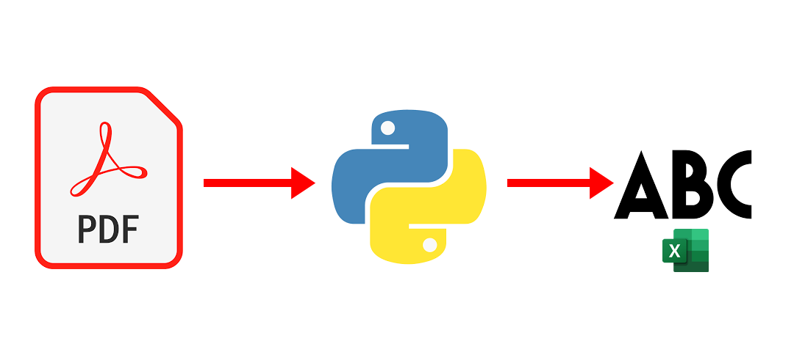

<h1 align="center"> FelipedelosH </h1>
 
<h4>PDF Data stractor</h4>

:construction: In Construction :construction:
  
This program is create to read a folder. And then read al text in every PDF file to extract information.

## :hammer:Funtions:

- `Function 1`: Read all PDF in folder  
- `Function 2`: Extract all text in PDF files and save in output folder 
- `Function 3`: Read: the text in every PDF file after charge 
- `Function 4`: Save: Numero de contenedor, booking, orden de compra ,hora de emission, fecha de emission, placa del vehiculo, Placa de carreta, numero de contenedor in EXCEL file 

## :play_or_pause_button:How to execute a project

Execute main.py

## :hammer_and_wrench:Tech.

- Python
- tkinter
- PyMuPDF 

## :warning:Warning.

- if the structure of PDF files change the program not read information.

## Autor

| [ Andrés Felipe Hernánez](https://github.com/felipedelosh)|
| :---: |